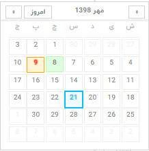

# React Persian Simple Calendar

## Install
```
npm i react-persian-simple-calendar
```

## Usage

```js
import DatePicker from 'react-persian-simple-calendar';

...

<DatePicker/>
```

## Properties

`selectedDay` shows selected day in orange. It's `string` or `undefined`.

`onDaySelected` event raised when `selectedDay` is changed.
It's of type `(event) => void` function, that `event` is of type `{previousDay, selectedDay}`.
Note that `previousDay` and `selectedDay` are `string`.

`onFocus` raised when date picker is focused. It's of type `() => void` function.
`onBlur` raised when date picker is blurred. It's of type `() => void` function.

```js
<DatePicker
    selectedDay="1397/3/6"
    onDaySelected={e => {
        console.log('previousDay: ', e.previousDay)
        console.log('selectedDay: ', e.selectedDay)
    }}
    onFocus={() => console.log('focused')}
    onBlur={() => console.log('blurred')}
/>
```

